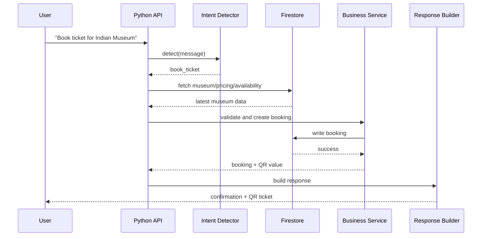

# Production Firestore Ticket Booking Chatbot Architecture

## 1. System Architecture

The chatbot must not depend on trained responses for live museum, ticket, booking, or pricing data. Firestore is the single source of truth.

```text
User Message
  -> Intent Detection
  -> Firebase Query
  -> Business Logic
  -> Response Generation
```

Recommended services:

- Python API backend: FastAPI or Flask.
- Firestore: source of truth for museums, bookings, tickets, FAQs, and scan logs.
- Intent detector: deterministic rules first, optional NLP model second.
- ChatterBot: fallback for generic FAQs only, not live data.
- QR service: generates QR from public booking ID.
- Email service: sends ticket confirmation with QR.
- Logging: structured application logs plus activity logs in Firestore/Realtime Database.

## 2. Project Folder Structure

```text
chatbot-engine/
  app/
    main.py
    config.py
    logging_config.py
    api/
      routes_chat.py
      routes_booking.py
      routes_health.py
    core/
      intent_detector.py
      response_builder.py
      errors.py
    firebase/
      firestore_client.py
      repositories.py
    services/
      booking_service.py
      museum_service.py
      qr_service.py
      faq_service.py
    schemas/
      chat.py
      booking.py
      museum.py
    tests/
      test_intents.py
      test_booking_service.py
  requirements.txt
```

## 3. Firestore Database Schema

```text
museums/{museumId}
  name: string
  location: string
  state: string
  category: string
  description: string
  timings:
    open: "10:00"
    close: "17:00"
    closedDays: ["Monday"]
  prices:
    Adult: number
    Child: number
    Student: number
    Senior Citizen: number
  active: boolean
  updatedAt: timestamp

bookings/{bookingId}
  bookingId: string
  userId: string
  email: string
  phone: string
  museumId: string
  museumName: string
  visitDate: string
  timeSlot: string
  visitorCombo: map
  numberOfTickets: number
  totalAmount: number
  status: "pending" | "confirmed" | "cancelled" | "expired"
  paymentStatus: "pending" | "paid" | "refunded"
  qrValue: string
  createdAt: timestamp
  updatedAt: timestamp

faqs/{faqId}
  question: string
  answer: string
  tags: array<string>
  active: boolean

scan_logs/{scanId}
  bookingId: string
  museumId: string
  action: "entry" | "exit" | "denied"
  reason: string
  scannedAt: timestamp
```

## 4. Intent Detection Implementation

Use deterministic intent detection for service actions. NLP fallback can help with fuzzy phrasing, but should not answer live data directly.

```python
# app/core/intent_detector.py
import re
from dataclasses import dataclass

@dataclass
class IntentResult:
    intent: str
    entities: dict
    confidence: float

class IntentDetector:
    BOOKING_ID_RE = re.compile(r"\b(?:BM|BK)\d+\b", re.I)

    def detect(self, message: str) -> IntentResult:
        text = message.strip().lower()
        booking_id = self._booking_id(message)

        if any(k in text for k in ["book", "reserve", "buy ticket"]):
            return IntentResult("book_ticket", {}, 0.95)
        if any(k in text for k in ["cancel", "refund"]):
            return IntentResult("cancel_ticket", {"bookingId": booking_id}, 0.95)
        if "available" in text or "availability" in text:
            return IntentResult("check_availability", {}, 0.9)
        if any(k in text for k in ["timing", "open", "close", "hours"]):
            return IntentResult("museum_timings", {}, 0.9)
        if any(k in text for k in ["price", "cost", "ticket rate"]):
            return IntentResult("ticket_prices", {}, 0.9)
        if "qr" in text:
            return IntentResult("generate_qr", {"bookingId": booking_id}, 0.9)
        if booking_id or any(k in text for k in ["my booking", "show ticket", "booking status"]):
            return IntentResult("check_booking", {"bookingId": booking_id}, 0.9)

        return IntentResult("faq", {}, 0.5)

    def _booking_id(self, message: str) -> str | None:
        match = self.BOOKING_ID_RE.search(message)
        return match.group(0).upper() if match else None
```

## 5. Firebase Integration Code

```python
# app/firebase/firestore_client.py
import os
import firebase_admin
from firebase_admin import credentials, firestore

_db = None

def get_firestore():
    global _db
    if _db:
        return _db

    if not firebase_admin._apps:
        cred = credentials.Certificate({
            "type": "service_account",
            "project_id": os.environ["FIREBASE_PROJECT_ID"],
            "client_email": os.environ["FIREBASE_CLIENT_EMAIL"],
            "private_key": os.environ["FIREBASE_PRIVATE_KEY"].replace("\\n", "\n"),
        })
        firebase_admin.initialize_app(cred)

    _db = firestore.client()
    return _db
```

```python
# app/firebase/repositories.py
from datetime import datetime, timezone
from .firestore_client import get_firestore

class MuseumRepository:
    def __init__(self):
        self.db = get_firestore()

    def get_active_museum(self, museum_id: str) -> dict | None:
        doc = self.db.collection("museums").document(museum_id).get()
        if not doc.exists:
            return None
        data = doc.to_dict()
        return {"id": doc.id, **data} if data.get("active", True) else None

    def search_by_name_or_location(self, query: str) -> list[dict]:
        docs = self.db.collection("museums").where("active", "==", True).stream()
        needle = query.lower()
        return [
            {"id": doc.id, **doc.to_dict()}
            for doc in docs
            if needle in doc.to_dict().get("name", "").lower()
            or needle in doc.to_dict().get("location", "").lower()
        ]

class BookingRepository:
    def __init__(self):
        self.db = get_firestore()

    def create(self, booking_id: str, payload: dict) -> dict:
        now = datetime.now(timezone.utc)
        doc = {
            **payload,
            "bookingId": booking_id,
            "status": "confirmed",
            "paymentStatus": "paid",
            "qrValue": booking_id,
            "createdAt": now,
            "updatedAt": now,
        }
        self.db.collection("bookings").document(booking_id).set(doc)
        return doc

    def get(self, booking_id: str) -> dict | None:
        doc = self.db.collection("bookings").document(booking_id).get()
        return {"id": doc.id, **doc.to_dict()} if doc.exists else None

    def update_status(self, booking_id: str, status: str) -> None:
        self.db.collection("bookings").document(booking_id).update({
            "status": status,
            "updatedAt": datetime.now(timezone.utc),
        })
```

## 6. Booking Service Layer

```python
# app/services/booking_service.py
from datetime import date
from uuid import uuid4
from app.firebase.repositories import BookingRepository, MuseumRepository
from app.services.qr_service import QRService

class BookingError(Exception):
    pass

class BookingService:
    def __init__(self):
        self.bookings = BookingRepository()
        self.museums = MuseumRepository()
        self.qr = QRService()

    def check_availability(self, museum_id: str, visit_date: str, requested: int) -> dict:
        museum = self.museums.get_active_museum(museum_id)
        if not museum:
            raise BookingError("Museum not found.")
        if visit_date < date.today().isoformat():
            raise BookingError("Visit date cannot be in the past.")
        return {"available": True, "remaining": 500, "museum": museum["name"]}

    def book_ticket(self, user: dict, payload: dict) -> dict:
        museum = self.museums.get_active_museum(payload["museumId"])
        if not museum:
            raise BookingError("Museum not found.")

        prices = museum.get("prices", {})
        visitor_combo = payload.get("visitorCombo") or {"Adult": payload.get("numberOfTickets", 1)}
        total = sum(int(prices.get(kind, 200)) * int(count) for kind, count in visitor_combo.items())

        booking_id = f"BM{uuid4().int % 10**16}"
        booking = self.bookings.create(booking_id, {
            "userId": user["id"],
            "email": user["email"],
            "phone": user.get("phone", ""),
            "museumId": museum["id"],
            "museumName": museum["name"],
            "visitDate": payload["visitDate"],
            "timeSlot": payload["timeSlot"],
            "visitorCombo": visitor_combo,
            "numberOfTickets": sum(int(v) for v in visitor_combo.values()),
            "totalAmount": total,
        })

        return {**booking, "qrDataUrl": self.qr.generate_data_url(booking_id)}

    def cancel_ticket(self, user: dict, booking_id: str) -> dict:
        booking = self.bookings.get(booking_id)
        if not booking:
            raise BookingError("Booking not found.")
        if booking["userId"] != user["id"]:
            raise BookingError("You cannot cancel another user's booking.")
        if booking["status"] == "cancelled":
            return booking

        self.bookings.update_status(booking_id, "cancelled")
        return {**booking, "status": "cancelled"}

    def check_existing_booking(self, user: dict, booking_id: str) -> dict:
        booking = self.bookings.get(booking_id)
        if not booking or booking["userId"] != user["id"]:
            raise BookingError("Booking not found for this account.")
        return booking
```

## 7. QR Generation Service

```python
# app/services/qr_service.py
import base64
from io import BytesIO
import qrcode

class QRService:
    def generate_data_url(self, value: str) -> str:
        image = qrcode.make(value)
        buffer = BytesIO()
        image.save(buffer, format="PNG")
        encoded = base64.b64encode(buffer.getvalue()).decode("utf-8")
        return f"data:image/png;base64,{encoded}"
```

## 8. API Endpoints

```python
# app/main.py
from fastapi import FastAPI, Depends, HTTPException
from app.core.intent_detector import IntentDetector
from app.core.response_builder import ResponseBuilder
from app.services.booking_service import BookingService, BookingError
from app.services.museum_service import MuseumService
from app.services.faq_service import FAQService
from app.schemas.chat import ChatRequest

app = FastAPI(title="Bharat Museum Chatbot API")

intent_detector = IntentDetector()
booking_service = BookingService()
museum_service = MuseumService()
faq_service = FAQService()
response_builder = ResponseBuilder()

def current_user():
    # Verify Firebase ID token or app JWT here.
    return {"id": "user123", "email": "user@example.com", "phone": "+910000000000"}

@app.post("/chat")
def chat(request: ChatRequest, user: dict = Depends(current_user)):
    try:
        detected = intent_detector.detect(request.message)

        if detected.intent == "book_ticket":
            return response_builder.ask_for_booking_details()
        if detected.intent == "cancel_ticket":
            result = booking_service.cancel_ticket(user, detected.entities["bookingId"])
            return response_builder.booking_cancelled(result)
        if detected.intent == "check_availability":
            result = booking_service.check_availability(
                request.context["museumId"],
                request.context["visitDate"],
                request.context.get("tickets", 1),
            )
            return response_builder.availability(result)
        if detected.intent == "museum_timings":
            return response_builder.timings(museum_service.get_timings(request.context["museumId"]))
        if detected.intent == "ticket_prices":
            return response_builder.prices(museum_service.get_prices(request.context["museumId"]))
        if detected.intent == "generate_qr":
            booking = booking_service.check_existing_booking(user, detected.entities["bookingId"])
            return response_builder.qr_ticket(booking)
        if detected.intent == "check_booking":
            booking = booking_service.check_existing_booking(user, detected.entities["bookingId"])
            return response_builder.booking_status(booking)

        return response_builder.faq(faq_service.answer(request.message))
    except BookingError as exc:
        raise HTTPException(status_code=400, detail=str(exc))
```

```python
# app/schemas/chat.py
from pydantic import BaseModel, Field

class ChatRequest(BaseModel):
    message: str = Field(min_length=1, max_length=1000)
    sessionId: str
    context: dict = {}
```

## 9. Sequence Diagram



## 10. Data Flow Diagram

```text
Chat UI
  -> POST /chat
  -> IntentDetector
  -> Repository reads Firestore
  -> Service validates business rules
  -> Repository writes Firestore if needed
  -> QRService generates QR for bookingId
  -> ResponseBuilder returns text + structured action/data
  -> Chat UI renders message, ticket card, QR, or form
```

## 11. Production Best Practices

- Treat Firestore as the only source of live data.
- Keep ChatterBot as optional fallback for generic conversation only.
- Use deterministic routing for booking, cancellation, QR, pricing, timings, and status.
- Verify Firebase ID token on every private request.
- Never expose another user's booking.
- Validate dates, ticket counts, museum status, and payment state server-side.
- Use structured logs with request ID, user ID, intent, and outcome.
- Keep secrets in environment variables or a secret manager.
- Add Firestore indexes for common queries.
- Rate-limit chat and booking endpoints.
- Use idempotency keys for payment confirmation.
- Add health endpoints for API, Firestore, and QR generation.
- Write tests for intent routing and booking ownership checks.

## 12. Response Builder Example

```python
# app/core/response_builder.py
from app.services.qr_service import QRService

class ResponseBuilder:
    def __init__(self):
        self.qr = QRService()

    def ask_for_booking_details(self):
        return {
            "message": "Please choose museum, date, time, and visitor category.",
            "action": {"type": "start_booking"},
        }

    def availability(self, result: dict):
        return {
            "message": f"{result['museum']} has tickets available. Remaining: {result['remaining']}.",
            "data": result,
        }

    def timings(self, timings: dict):
        closed = ", ".join(timings.get("closedDays", [])) or "None"
        return {
            "message": f"Open: {timings['open']} to {timings['close']}. Closed days: {closed}.",
            "data": timings,
        }

    def prices(self, prices: dict):
        lines = [f"{kind}: INR {amount}" for kind, amount in prices.items()]
        return {"message": "Ticket prices:\n" + "\n".join(lines), "data": prices}

    def booking_status(self, booking: dict):
        return {
            "message": f"Booking {booking['bookingId']} is {booking['status']}. Payment: {booking['paymentStatus']}.",
            "data": booking,
        }

    def qr_ticket(self, booking: dict):
        return {
            "message": f"Here is your QR ticket for booking {booking['bookingId']}.",
            "action": {
                "type": "show_qr_ticket",
                "bookingId": booking["bookingId"],
                "qrDataUrl": self.qr.generate_data_url(booking["bookingId"]),
            },
        }

    def booking_cancelled(self, booking: dict):
        return {
            "message": f"Booking {booking['bookingId']} has been cancelled.",
            "data": booking,
        }

    def faq(self, answer: str):
        return {"message": answer}
```

## Core Rule

When museum data, prices, timings, bookings, or FAQ content changes in Firestore, the chatbot should use the new data immediately on the next request. No retraining is required for live data changes.
