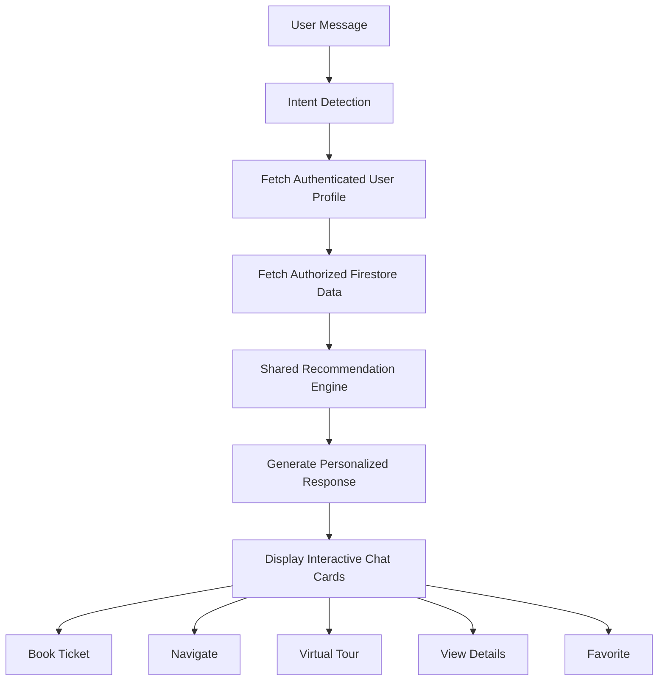
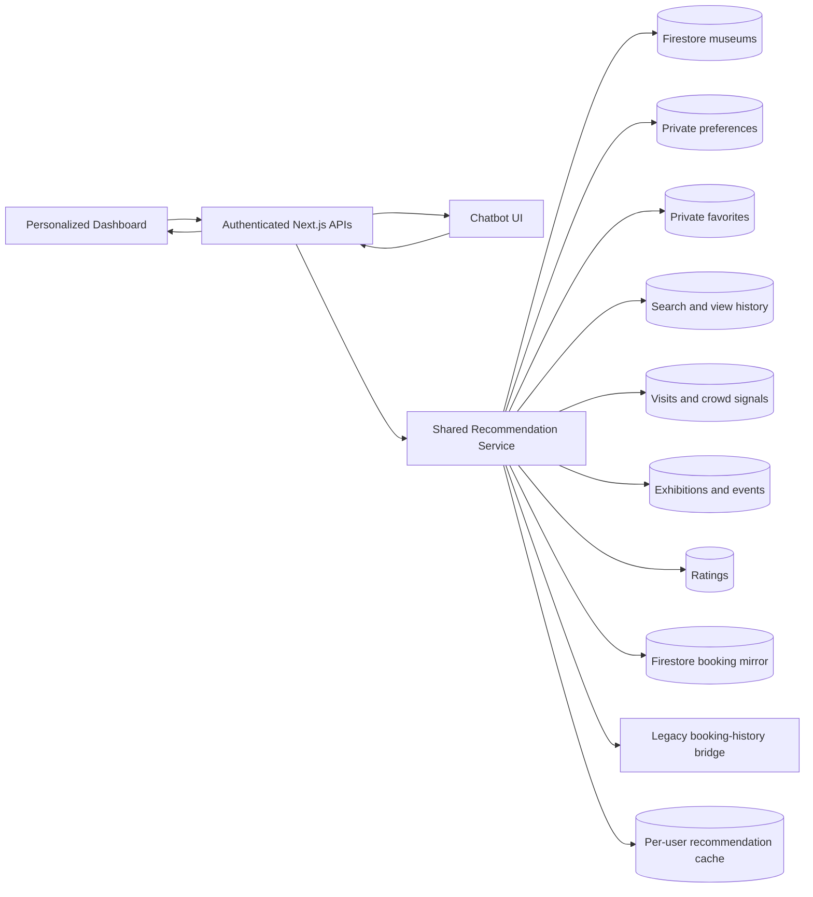
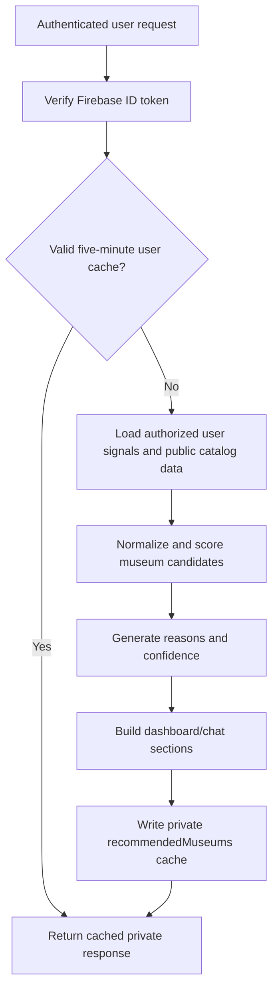
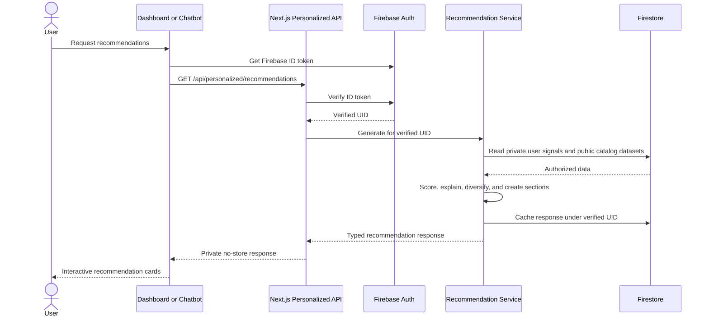

# Personalized Experience Feature Specification

## Document Status

This document defines the requirements and records the implemented architecture for the **Personalized Experience** feature.

## Implementation Status

The initial production implementation is available at:

```text
/personalized
```

The home page also includes a lazy-loaded preview of the authenticated user's top four recommendations. Guests see a sign-in explanation, while signed-in users can favorite, book, navigate, and open configured virtual tours directly from the preview.

It includes the shared Firestore recommendation engine, authenticated APIs, private preference/favorite/activity storage, responsive website dashboard, chatbot recommendation cards, explainable scores, cache invalidation, and booking/directions deep links. Optional sections remain empty until their corresponding live Firestore datasets are populated; the application does not invent exhibitions, ratings, crowd levels, or trending activity.

## Product Objective

Build a production-ready, AI-powered recommendation system for Bharat Museum Tickets that provides:

- Personalized museum recommendations.
- Exhibition highlights.
- Travel suggestions.
- Booking recommendations.
- Personalized visit planning and itineraries.

The same recommendation engine and Firestore data must support both:

1. The manual website interface.
2. The AI chatbot.

## Engineering Roles and Quality Bar

The implementation should be approached from the perspective of a senior full-stack software architect, AI engineer, and UX designer. It must be modular, scalable, maintainable, secure, and production-ready, with clear comments and explanations for every major component.

## Technology Stack

### Frontend

- Next.js and React.
- TypeScript.
- Tailwind CSS.

### Backend

- Node.js.
- Express.js where required by the existing architecture.

### Database

- Firebase Cloud Firestore.

### Authentication

- Firebase Authentication.

### Chatbot

- Python.
- ChatterBot for intent detection only.

### Maps

- Google Maps API.

## Architectural Constraints

- Do not hardcode recommendations.
- Do not train ChatterBot with recommendation data.
- Firestore must remain the single source of truth.
- Generate every recommendation dynamically from Firestore data.
- The website and chatbot must use the same recommendation engine.
- ChatterBot may detect recommendation-related intent, but recommendation ranking and content must come from the shared recommendation service.

## Firestore Data Model Requirements

Design and implement the following collections:

```text
users
preferences
bookings
favorites
searchHistory
visitedMuseums
recommendedMuseums
museumCategories
museumRatings
museumVisits
events
exhibitions
```

### User Personalization Profile

Each user profile must support:

- Favorite categories.
- Favorite museums.
- Preferred language.
- Budget preference.
- Preferred city and state.
- Preferred travel mode.
- Previous bookings.
- Search history.
- Recently viewed museums.

The final schema must define document ownership, identifiers, timestamps, references, indexes, retention behavior, and which data is derived versus user-authored.

## Manual Website Experience

Create a responsive Personalized Dashboard.

### Dashboard Header

- Display a personalized **Welcome Back** message.
- Show useful context such as the user's preferred city or current planning period when available.

### Recommendation Sections

- Recommended Museums.
- Recommended Exhibitions.
- Recently Viewed.
- Continue Exploring.
- Suggested Visit Time.
- Nearby Museums.
- Trending Museums.
- Less Crowded Museums.
- Quick Actions.

### Quick Actions

- Book Ticket.
- Virtual Tour.
- Directions.
- Save to Favorites.

### Recommendation Explanations

Every recommendation must include a concise, understandable reason. Examples:

```text
Recommended because you like History Museums.
Recommended because you visited Victoria Memorial.
Trending in your city.
Popular this weekend.
```

## Chatbot Experience

The chatbot should personalize conversations automatically when the user is authenticated and personalization data is available.

### Museum Recommendation Example

**User**

```text
Recommend a museum
```

**Bot**

```text
Based on your interests, I recommend Indian Museum.

Reason: You recently explored historical museums.
```

Display buttons for:

- Book Ticket.
- Directions.
- Virtual Tour.
- More Like This.

### Same-Day Recommendation Example

**User**

```text
What should I visit today?
```

**Bot**

```text
Considering your previous visits, favorite categories,
current exhibitions, and crowd level, I recommend:

Victoria Memorial

Estimated visit: 2 hours
Current crowd: Low

Would you like directions or to book tickets?
```

### Preference Learning Example

**User**

```text
I like science museums.
```

**Bot**

```text
Great! I will remember your preference.
Your profile has been updated.

Recommended:
- Science City
- National Science Centre
- Birla Industrial Museum
```

Preference changes must be explicitly stored for the authenticated user and should be reversible from account settings.

### Trip Planning Example

**User**

```text
Plan my museum trip.
```

**Bot**

```text
Here is your itinerary.

09:30 - Indian Museum
12:00 - Lunch
14:30 - Victoria Memorial
17:00 - Virtual Tour
```

Display buttons for:

- Book Tickets.
- Directions.
- Save Itinerary.

## Recommendation Engine Inputs

The recommendation engine should consider:

- Previous bookings.
- Previous searches.
- Favorites.
- Museum category.
- Current or preferred city.
- Nearby museums.
- User budget.
- Trending museums.
- Current exhibitions.
- Upcoming events.
- Crowd density.
- Museum rating.
- Seasonal events.
- Language preference.
- Previously visited museums.
- Recommendation confidence score.

The design must define scoring weights, fallback behavior for new users, freshness rules, diversity controls, deduplication, exclusion rules, and how confidence is calculated and presented.

## Chatbot Processing Flow



## Website UI Requirements

- Responsive layouts for desktop, tablet, and mobile.
- Modern visual design.
- Glassmorphism where it improves hierarchy and readability.
- Loading skeletons.
- Purposeful animations.
- Empty states.
- Error and retry states.
- Accessible keyboard navigation and focus states.
- Reduced-motion support.

## Chatbot UI Requirements

Recommendation cards should display:

- Museum image.
- Museum name.
- Distance.
- Rating.
- Recommendation reason.
- Confidence where useful and understandable.

Each card should provide relevant actions:

- Book Ticket.
- Navigate Here.
- Virtual Tour.
- Favorite.
- View Details.
- More Like This where appropriate.

## Performance Requirements

- Use Firestore efficiently.
- Cache frequently requested recommendation results.
- Avoid unnecessary Firestore reads.
- Implement pagination where appropriate.
- Lazy-load recommendation sections.
- Use bounded caches with clear invalidation rules.
- Recompute recommendations when meaningful source data changes.
- Avoid fetching private user datasets that are not required for the active request.

## Security and Privacy Requirements

- Use only the authenticated user's private personalization data.
- Follow least-privilege Firestore security rules.
- Never expose another user's preferences, searches, favorites, visits, or bookings.
- Validate Firebase authentication on protected backend endpoints.
- Treat client-supplied user identifiers as untrusted.
- Keep recommendation reads scoped to the verified Firebase UID.
- Separate public museum/event data from private user behavior.
- Validate and sanitize preference updates.
- Document data retention and deletion behavior.
- Avoid placing private user data in shared caches or logs.

## Required Deliverables

The implementation phase must provide:

1. Complete system architecture.
2. Data Flow Diagram (DFD).
3. Sequence diagram.
4. Firestore schema.
5. Updated folder structure.
6. Backend APIs.
7. Recommendation engine.
8. Firestore query logic.
9. Chatbot integration.
10. React components.
11. Responsive UI.
12. Complete production-ready code.
13. Error handling.
14. Performance optimizations.
15. Security best practices.

## Expected Implementation Characteristics

The completed feature must be:

- Dynamic and Firestore-driven.
- Shared across website and chatbot experiences.
- Explainable to users through recommendation reasons.
- Securely scoped to the authenticated user.
- Efficient in Firestore reads and recommendation computation.
- Accessible and responsive.
- Testable at the recommendation, API, Firestore-rule, component, and end-to-end levels.
- Maintainable through modular services, typed contracts, and clear documentation.

## Implemented System Architecture



The Next.js service is the sole recommendation implementation. The Python/ChatterBot layer remains responsible for general conversational intent only; recommendation data is never trained into ChatterBot. Website and chatbot consumers receive the same typed response.

## Implemented Data Flow



## Implemented Sequence



## Implemented Folder Structure

```text
client/src/
├── app/
│   ├── personalized/page.tsx
│   └── api/personalized/
│       ├── activity/route.ts
│       ├── favorites/route.ts
│       ├── preferences/route.ts
│       └── recommendations/route.ts
├── components/personalized/
│   ├── PersonalizedDashboard.tsx
│   ├── PreferencePanel.tsx
│   ├── RecommendationCard.tsx
│   └── RecommendationSection.tsx
└── lib/
    ├── recommendations.ts
    └── services/recommendationService.ts
```

Integration updates also exist in:

```text
client/src/components/booking/BookingWithChatBot.tsx
client/src/components/personalized/PersonalizedHomeSection.tsx
client/src/components/personalized/PersonalizedHomeLoader.tsx
client/src/components/booking/BookTicket.tsx
client/src/components/mvpblocks/feature-1.tsx
client/src/components/mvpblocks/header-2.tsx
client/src/components/ui/activity-tracker.tsx
client/src/app/booking/directions/page.tsx
client/src/lib/api.ts
client/src/lib/services/bookingService.ts
firestore.rules
firestore.indexes.json
```

The repository contains matching root-level and `client/` Firestore rules/index files for its two existing Firebase working-directory conventions. Both copies include the personalization security rules and indexes.

## Implemented API Contracts

All routes require a Firebase ID token using `Authorization: Bearer <token>`.

### Generate recommendations

```text
GET /api/personalized/recommendations
GET /api/personalized/recommendations?refresh=true
```

The normal request uses a private five-minute per-user Firestore cache. `refresh=true` recomputes immediately.

### Read or update preferences

```text
GET /api/personalized/preferences
PUT /api/personalized/preferences
```

Example update:

```json
{
  "favoriteCategories": ["History", "Science"],
  "preferredLanguage": "en",
  "budgetMax": 500,
  "preferredCity": "Kolkata",
  "preferredState": "West Bengal",
  "travelMode": "TRANSIT"
}
```

### Update favorite

```text
POST /api/personalized/favorites
```

```json
{
  "museumId": "museum_identifier",
  "favorite": true
}
```

### Record personalization activity

```text
POST /api/personalized/activity
```

Supported types are `viewed`, `search`, and `visited`.

## Recommendation Scoring

Each live museum starts with a neutral base score. Independent signals then adjust it:

| Signal | Behavior |
| --- | --- |
| Favorite category | Strong positive match |
| Previously booked category | Positive similarity signal |
| Saved favorite | Positive explicit-interest signal |
| Preferred city/state | Positive nearby-area signal |
| Budget | Positive when the base ticket price is within budget |
| Recent search/view | Positive textual relevance signal |
| Visitor rating | Bounded positive quality signal |
| Real visits/bookings | Logarithmically bounded trend signal |
| Low live crowd | Positive planning signal |
| Already visited | Small diversity penalty |

Scores are converted to a bounded confidence percentage. Every result includes up to three human-readable reasons. Missing data contributes nothing rather than using dummy values.

## Cache and Invalidation

- Cache collection: `recommendedMuseums`.
- Cache document ID: verified Firebase UID.
- TTL: five minutes.
- Cached API responses remain private and use `Cache-Control: private, no-store` at the browser boundary.
- Preference, favorite, viewed, search, and visited writes invalidate the user's cache.
- In-flight UI actions use optimistic favorite updates with rollback on failure.

## Booking Compatibility

New bookings are mirrored to the Firestore `bookings` collection for personalization while the established ticket and QR flow continues using Realtime Database during migration. The recommendation service prefers Firestore booking signals and uses the existing authenticated history service only as a compatibility fallback for earlier bookings.

## Chatbot Integration

The chatbot locally recognizes phrases including:

```text
Recommend a museum
What should I visit today?
I like science museums
Plan my museum trip
Show me more like this
```

Authenticated recommendation cards provide:

- Museum image and name.
- Location, category, price, rating, and crowd state when available.
- Recommendation confidence and reason.
- Book Ticket.
- Directions.
- Favorite.
- More Like This.

Preference statements update the private profile and immediately recompute the response. The chatbot never receives another user's data and does not store recommendations as training responses.

Virtual Tour actions are rendered only when the live Firestore museum document contains a valid `virtualTourUrl`. Missing URLs produce an unavailable state instead of a fabricated destination.

## Firestore Deployment

Deploy the updated rules and indexes before production use:

```powershell
firebase deploy --only firestore:rules,firestore:indexes
```

Public aggregate collections (`museumRatings`, `museumVisits`, `events`, `exhibitions`, and `museumCategories`) are readable for discovery. Private collections require ownership by the authenticated UID. Only administrators or authorized museum/controller roles can publish operational aggregate data.

## Verification

```powershell
cd client
npx tsc --noEmit
npm run lint
npm run build
```

Manual verification should cover signed-out access, preference updates, cache refresh, favorite rollback, empty optional datasets, booking and directions deep links, chatbot recommendation intents, cross-user security isolation, responsive layouts, and reduced-data/error conditions.
