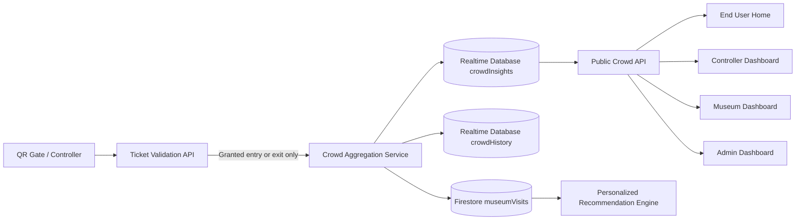
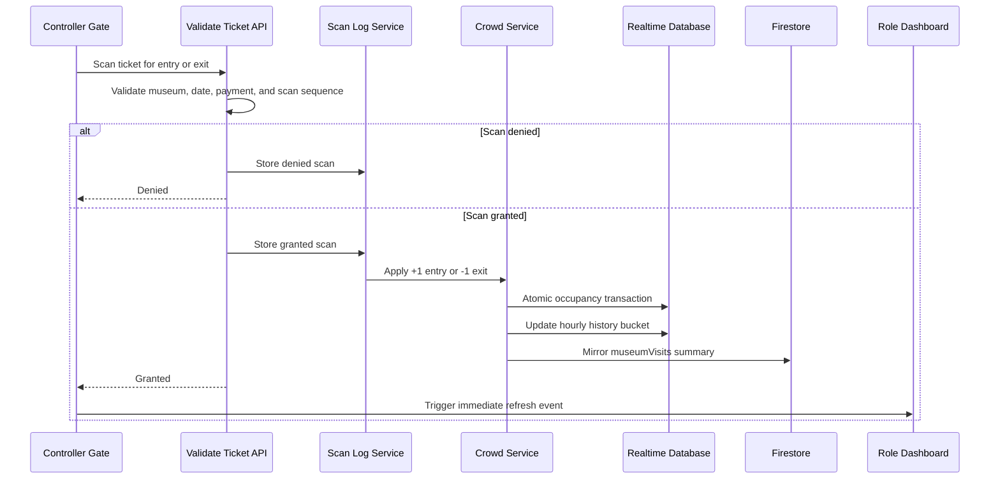

# Crowd Management Insights Feature

## Purpose

Crowd Management Insights turns verified gate activity into a shared, real-time view of museum occupancy. It is available to:

- End users on the home page for visit planning.
- Controllers for immediate gate feedback.
- Museum supervisors for capacity and daily flow management.
- Administrators for cross-museum operational oversight.

The feature does not estimate attendance from bookings. Only successfully granted entry and exit scans change the live visitor count.

## Role Experiences

### End User

The home page displays up to six museums with:

- Current visitors inside.
- Crowd level.
- Capacity utilization when capacity is configured.
- Entries and exits today.
- Peak visitors today.
- Visit guidance such as comfortable, moderate, busy, or near capacity.

### Controller

The controller dashboard displays gate occupancy alongside the entry and exit terminals. A granted scan refreshes the crowd panel immediately. Denied or invalid scans never change occupancy.

Controllers can monitor but cannot change museum capacity.

### Museum Supervisor

The museum dashboard shows the assigned museum's:

- Current occupancy.
- Daily entry and exit totals.
- Daily peak attendance.
- Capacity percentage.
- Congestion level.

Museum supervisors can configure capacity only for a museum whose `loginEmail` matches their authenticated email.

### Administrator

The admin dashboard shows all museums in a single operational view. Administrators can configure capacity for any museum.

## Architecture



Realtime Database provides atomic counters and low-latency operational state. Firestore receives a summary mirror so the shared personalization engine can rank genuinely less-crowded museums.

## Scan Processing Sequence



## Data Model

### Realtime Database: `crowdInsights/{encodedMuseumId}`

```text
museumId
museumName
currentVisitors
capacity
entriesToday
exitsToday
peakVisitorsToday
dateKey
updatedAt
lastDeviceId
```

### Realtime Database: `crowdHistory/{encodedMuseumId}/{date}/{hour}`

```text
entries
exits
peakVisitors
updatedAt
```

### Firestore: `museumVisits/{encodedMuseumId}`

```text
museumId
museumName
currentVisitors
capacity
occupancyPercent
crowdLevel
entriesToday
exitsToday
peakVisitorsToday
totalVisits
dateKey
updatedAt
```

## Crowd Thresholds

| Occupancy | Level |
| --- | --- |
| Capacity missing | Unknown |
| Below 40% | Low |
| 40% to below 75% | Moderate |
| 75% to below 90% | High |
| 90% or above | Critical |

Without a configured capacity, the feature still reports verified visitor counts and daily flow but does not fabricate a crowd level.

## API

### Public crowd status

```text
GET /api/crowd
GET /api/crowd?museumId=museum_identifier
```

Responses use a short shared cache and are refreshed by clients every 15 seconds.

### Configure capacity

```text
PUT /api/crowd
Authorization: Bearer <Firebase ID token>
```

```json
{
  "museumId": "museum_identifier",
  "capacity": 500
}
```

Only administrators and the assigned museum supervisor are authorized.

## Safety and Integrity

- Counts update only after full ticket validation succeeds.
- Denied scans do not affect occupancy.
- Exit counts are clamped so occupancy never becomes negative.
- Ticket scan sequencing prevents exits without entries and duplicate over-entry.
- Daily counters reset using the Asia/Kolkata date.
- Realtime updates use transactions to avoid lost increments from concurrent gates.
- Capacity writes require verified Firebase authentication and role/ownership checks.
- Clients cannot directly write crowd aggregates or history.
- The API never exposes visitor identity in crowd responses.

## Main Files

```text
client/src/lib/crowd.ts
client/src/lib/services/crowdService.ts
client/src/app/api/crowd/route.ts
client/src/components/crowd/CrowdInsightsPanel.tsx
client/src/components/crowd/CrowdHomeLoader.tsx
client/src/lib/services/controllerService.ts
client/src/app/controller-dashboard/page.tsx
client/src/app/museum-dashboard/page.tsx
client/src/app/admin/page.tsx
client/src/app/page.tsx
database.rules.json
client/database.rules.json
```

## Deployment

Deploy both Firestore and Realtime Database rules from the intended Firebase working directory:

```powershell
firebase deploy --only firestore:rules,firestore:indexes,database
```

Configure a capacity from the museum or admin dashboard before relying on congestion levels.

## Verification

1. Scan one valid ticket at an entry gate and confirm occupancy increases by one.
2. Scan the same visit at an exit gate and confirm occupancy decreases by one.
3. Confirm denied scans do not change counts.
4. Confirm the controller panel refreshes immediately.
5. Confirm the home, museum, and admin views reconcile within 15 seconds.
6. Confirm a museum account cannot update another museum's capacity.
7. Confirm a controller account cannot update capacity.
8. Confirm Firestore `museumVisits` updates and personalized crowd reasons follow the live level.
