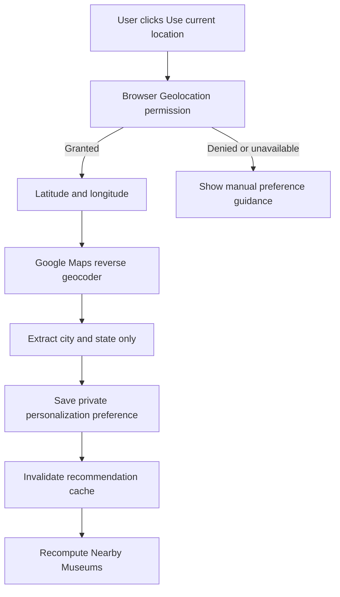

# Continue Exploring and Nearby Museums Plan

## Goal

Make the Personalized Experience sections useful for both established users and new users without hardcoded museum recommendations or fake proximity data.

The affected sections are:

- **Continue Exploring**
- **Nearby Museums**

## Problem Being Solved

Previously, Continue Exploring depended primarily on previous booking categories. A user without a suitable booking could see only an empty state even when live museums were available.

Nearby Museums required a preferred city or state. The empty state explained the requirement but did not help the user provide a location directly.

## Implementation Plan

### Phase 1: Recommendation Signal Audit

Status: Completed

- Inspect previous bookings from the Firestore mirror and legacy authenticated booking-history bridge.
- Inspect favorite categories and favorite museums.
- Inspect recently viewed museums and search history.
- Inspect private preference and profile address fields.
- Confirm museums continue to come exclusively from the live Firestore catalog.

### Phase 2: Continue Exploring Ranking

Status: Completed

Build an interest-category set from:

1. Previous booking categories.
2. Explicit favorite categories.
3. Categories of favorite museums.
4. Categories of recently viewed museums.

Return museums that match those categories while excluding already visited or booked museums where possible.

If no category-related museum exists, use unvisited and unbooked museums from the dynamically ranked live catalog as a cold-start discovery fallback. This fallback does not use static or dummy museum data.

### Phase 3: Nearby Area Resolution

Status: Completed

Resolve area signals in this order:

1. Preferred city.
2. Preferred state.
3. Previous booking visitor location.
4. Private user profile address.

Compare meaningful location tokens with each museum's Firestore `location` and `state` fields.

### Phase 4: Actionable Nearby Empty State

Status: Completed

Provide two actions when there are no nearby matches:

- **Use current location**
- **Enter city or state**

Current-location flow:



The application does not persist raw GPS coordinates. Only the resolved city and state are saved to the authenticated user's private preference document.

### Phase 5: Cache and UX

Status: Completed

- Invalidate the per-user recommendation cache after saving the location preference.
- Force one immediate recommendation refresh.
- Disable the location button while detection is running.
- Show permission, GPS, geocoding, Maps configuration, and unmatched-area errors clearly.
- Keep manual preference entry available as the dependable fallback.

### Phase 6: Verification

Status: Completed after the checks listed below pass.

## Implemented Continue Exploring Logic

```text
Live Firestore museums
        +
booking categories
favorite categories
favorite museum categories
recently viewed categories
        ↓
related unvisited/unbooked museums
        ↓
live-catalog discovery fallback when no related result exists
```

This ensures the section remains dynamic and explainable while reducing unnecessary empty states.

## Implemented Nearby Logic

```text
preferred city/state
        or
booking visitor location
        or
profile address
        or
explicit browser location action
        ↓
normalized area tokens
        ↓
Firestore museum location/state matching
```

## Privacy and Security

- Geolocation is requested only after an explicit user click.
- Raw latitude and longitude are not written to Firestore.
- City and state preferences are stored only for the verified Firebase UID.
- Recommendation APIs enforce Firebase ID-token authentication.
- No other user's location, preferences, or activity is readable.
- Firestore museum data remains the only museum source.

## Error Handling

Handled states include:

- Browser geolocation unsupported.
- Permission denied.
- GPS timeout or unavailable position.
- Missing Google Maps API configuration.
- Reverse-geocoding failure.
- City/state not present in the geocoder response.
- No Firestore museum matching the resolved area.
- Preference-save or recommendation-refresh failure.

## Main Files

```text
client/src/lib/services/recommendationService.ts
client/src/components/personalized/PersonalizedDashboard.tsx
client/src/components/personalized/RecommendationSection.tsx
client/src/lib/googleMaps.ts
docs/20-continue-exploring-nearby-museums-plan.md
```

## Required Environment

Browser location reverse geocoding uses:

```env
NEXT_PUBLIC_GOOGLE_MAPS_API_KEY=your_browser_restricted_key
```

The key must allow the Maps JavaScript API for the deployed website origin.

## Verification Checklist

1. A user with booking history sees related, unvisited museums in Continue Exploring.
2. A user with favorite categories but no booking still receives related results.
3. A new user receives a discovery fallback from the live Firestore catalog.
4. A user with a preferred city/state receives matching nearby museums.
5. A user can click Use current location and approve permission.
6. The resolved city/state is saved and raw coordinates are not stored.
7. Denied location permission leaves manual entry available.
8. An unmatched city displays the actionable empty state instead of dummy museums.
9. Cached recommendations refresh after the location changes.
10. TypeScript, lint, and the production build pass.
